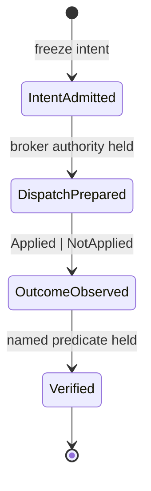
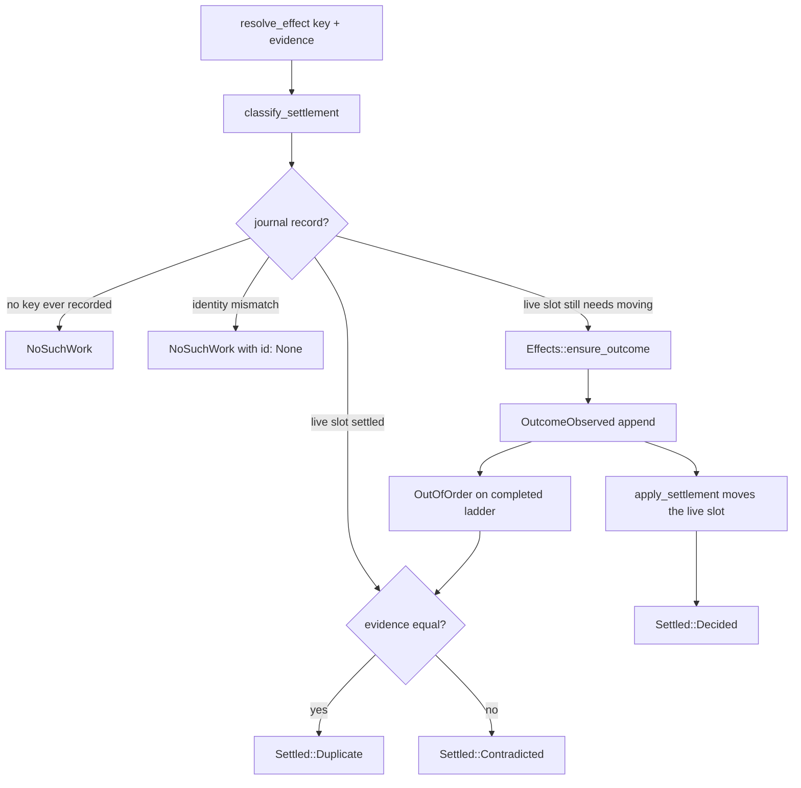
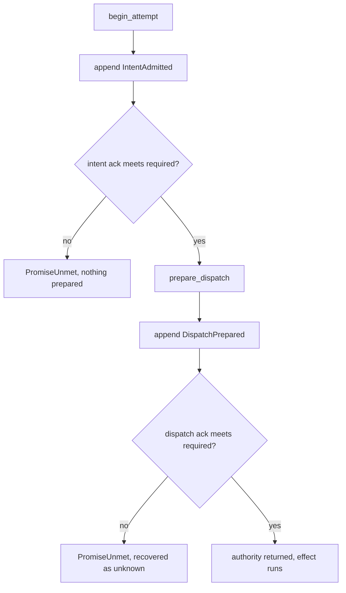
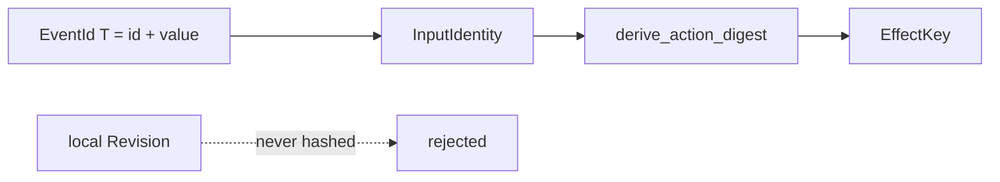

# Effect kernel architecture

Status: **partly landed.** The journal ladder, recovery fold, settlement
unification, recovered-unknown barrier, admitted-input identity, and external
handoff admission are on `main` (#110–#115). The remaining release gate is
[#109](https://github.com/srinji-kaggss/logicalworks-crates/issues/109): its
real backing-store process-kill observations are still unrun. Process ownership
(#117), locator eligibility (#116), and cross-controller fencing (#120) are
separate surfaces and are not covered here.

This page is for implementers and reviewers. The consumer-facing story is in
[the guides](guides/lgwks-bot/index.md); the release gate that these
invariants feed is issue
[#109](https://github.com/srinji-kaggss/logicalworks-crates/issues/109).

## Why there is a kernel

An `Execute` action may reach outside the process. Once it has, the process
can die before anything records that fact, and a recovered controller cannot
tell "the effect never left" from "the record of it leaving was lost." Every
design choice below exists to keep those two states distinguishable.

Issue [#109](https://github.com/srinji-kaggss/logicalworks-crates/issues/109)
names the root defect this kernel has to answer: **multiple authorities over
the same lifecycle.** Transient `EntryState`/`AttemptRecord`, recovered
`Effects` sets, journal events, `first_unresolved`, `pending` and the counts
used to give different answers to one question. The repair rule is that the
journal is authoritative about *what the outcome is*, and the live slot is
authoritative about *whether it still needs moving*. Everything else derives
from those two.

## The journal ladder

One attempt at one intent walks four events exactly once. A retry is a new
`AttemptId` and therefore a new key, which is why a second `DispatchPrepared`
for an existing key is not representable.



`EventKind::next` encodes that order (`crates/lgwks-bot/src/journal.rs`). An
append that would skip a rung returns `JournalError::OutOfOrder` with the
`expected` kind. When `expected` is `Some(Verified)` or `None`, the ladder is
already complete: a second `OutcomeObserved` is a *repeat*, and it is an
idempotent success only when the recorded evidence matches. A different
evidence on a completed ladder is `Settled::Contradicted`, not a silent
overwrite.

## Recovery

`recover` folds the journal into one `AttemptStatus` per key. The fold is the
single derivation; nothing reconstructs state by guessing.

```mermaid
stateDiagram-v2
    [*] --> Prepared: IntentAdmitted only
    [*] --> OutcomeUnknown: DispatchPrepared, no outcome
    [*] --> Applied: OutcomeObserved(Applied)
    [*] --> NotApplied: OutcomeObserved(NotApplied)
    [*] --> Verified: Verified
    OutcomeUnknown --> [*]: barrier; never auto-replay
```

`OutcomeUnknown` is the dangerous one. It is deliberately *not* `NotApplied`:
nothing established that the bytes did not arrive, and assuming they did not
is how a duplicate non-idempotent effect gets sent. An unknown is a barrier
ahead of any later work on the same chain. The recovered-unknown barrier stays
in force even when the chain's current condition is false, so a `Skip` for a
blocked action `break`s rather than `skip()`s and a successor cannot run on the
strength of "the predecessor is no longer active."

## Settlement

Live settlement and recovered settlement share one write path. The decision
is read-only first, so a refusal cannot leave half-moved memory.



`classify_settlement` compares the whole ownership identity (run, flow, and
environment). A key from another run, flow, or environment is `NoSuchWork`
and must not mutate anything. `apply_settlement` runs only when the live slot
still has something to move; an abandoned entry reopened by a `NotApplied`
confirmation is exactly that case, and answering `Duplicate` before the move
is how that reopen stopped happening.

## Durability and external handoff

`Execute::effect_lifetime()` declares whether an action leaves the process.
The default is `External`, because a handoff that forgets to declare itself
must fail closed.



The check is on the **per-append acknowledgment**, not on the journal's
advertised grade. A store that claims `ProcessCrash` and acks `Ephemeral` is
weaker than it says, and the weaker fact is the one that matters (issue
#100). `MemoryJournal` stays `Ephemeral`; a test that wants an external
effect on it must declare `EffectLifetime::Local`, which is what the README
examples now do.

`DurabilityPromise::meets` ranks `Ephemeral < ProcessCrash < PowerLoss`. An
external handoff requires `ProcessCrash` or better on both the intent and the
dispatch acknowledgment. The refusal happens before `DispatchPrepared` is
committed whenever the intent ack is already too weak. When a weak dispatch ack
may already have committed, the kernel does not invent `NotApplied`; recovery
holds the attempt unknown until evidence establishes its outcome.

The crate ships two adapters. `MemoryJournal` is `Ephemeral` and stays the
default, because a `Vec` in the dying process is the one promise it can keep.
`FileJournal` (`journal/file.rs`) is the shipped `ProcessCrash` adapter: one
length-framed event per frame with the append's chain head stored beside it,
`sync_all` before every acknowledgment, a torn tail truncated on open because
it was never acknowledged, and a frame whose bytes or stored head lie refused
as `JournalError::Corrupt` because it may have been.
`tests/durable_crash_observation.rs` is the external half of this design: a
real `SIGKILL` mid-ladder against that real file, then a restart, then the
recovered answer asserted — rows #100, #101, #102, #104 and #106 of the #109
register. Its concurrent-writer exclusion is a caller obligation, recorded in
the adapter's own documentation.

## Identity

`EffectKey` is the settlement identity: run, flow, environment, action,
attempt, and a content digest. *In flight (#114):* the digest binds the
**admitted input**, not a process-local `Revision`. Same content after restart
must retire landed work; equal content with a distinct event id must run.



Digest parts are length-prefixed so two different splits of the same byte
string cannot collide. Domains are `action-id.v2` and `action-digest.v2`.
Portable framing uses fixed-width `portable_index(usize) -> u64` so a digest
computed on a 32-bit and a 64-bit host agree.

## What one authority means in practice

Reads derive from one fold. `Ledger::unresolved` is the single walk behind
`pending`, `first_unresolved`, and `unresolved_count`; three separate walks
are three chances to disagree. `Effects::ensure_outcome` is the single write
behind live settlement, recovered settlement, and the post-effect recording
retry; three appends are three chances to lose the `Applied` fold that lets a
returning landed event retire instead of wedging as `Unrecorded`.

An `OutcomeObserved` record is not sufficient evidence of settlement when its
append acknowledgement was weak. An adapter may issue an explicit outcome
receipt, but the kernel accepts it only when positioned readback verifies that
position contains the exact outcome; a receipt for genesis or a later,
unrelated append is refused. Durable recovery keeps an unverifiable record as
`RecordingFailed` and never re-enters its action. This verifies receipt/event
binding within the adapter trust boundary; it is not a cryptographic or
physical-storage durability proof. The v1 event wire contract deliberately
remains unchanged.

## Where the tests live

| Claim | Test |
|---|---|
| Live settlement is journaled before acknowledged | `tests/durable_dispatch.rs::a_live_settlement_is_journaled_before_it_is_acknowledged` |
| Recording failure does not become a refusal | `tests/durable_dispatch.rs` (issue #102 regressions) |
| Fingerprint and value commit together | `tests/durable_dispatch.rs` (issue #100 regressions) |
| Returning landed event retires | `tests/durable_dispatch.rs::a_returning_landed_event_is_retired_not_refused` |
| No false `Unrecorded` barrier on refusal | `tests/durable_dispatch.rs::a_refused_handoff_leaves_no_unrecorded_barrier` |
| Weak ack never records `DispatchPrepared` | `tests/durable_dispatch.rs::a_weak_ack_does_not_record_dispatch_prepared` |
| An unrelated durable outcome receipt is refused without re-entering the action | `tests/durable_dispatch.rs::an_unrelated_outcome_receipt_is_refused_without_reentering_the_effect` |

Acceptance falsifiers T09–T16 and T35 in
[orchestration-acceptance.spec.md](orchestration-acceptance.spec.md) are the
external observations this kernel still owes. A green unit test is not one of
them.
