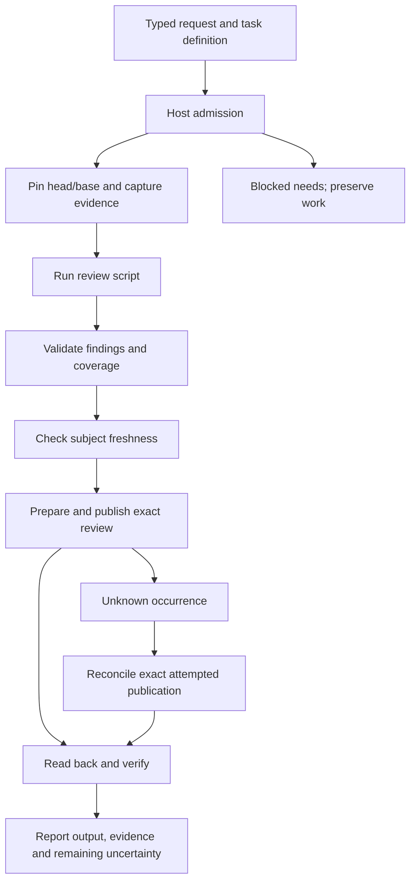

# Reference journey: review a PR with a task and its script

Status: **proposed acceptance journey, not a shipped example**.
Tracker: [#87](https://github.com/srinji-kaggss/logicalworks-crates/issues/87).
This is not an instruction to perform or publish an actual PR review while
reading the specification.

## The front door and the full bill

**PR-01.** The consumer supplies one task definition and a typed request.
The host profile is configured once and includes the GitHub read/publish
adapter, script or model adapter, workspace isolation, limits and any durable
storage required by the chosen mode. A read-only profile may produce a draft;
it may not silently acquire publication rights.

Illustrative API target (names are not yet implemented):

```text
let review = task("review-pr", review_script);
let report = host.run(review, request).await?;

async fn review_script(work: &Work, request: ReviewRequest)
    -> WorkResult<PublishedReview>
{
    let snapshot = work.query(gh::snapshot(request)).await?;
    let draft = work.execute(review::script(&snapshot)).await?;
    let checked = validate_findings(&snapshot, draft)?;
    work.execute(gh::publish_checked(&snapshot, checked)).await
}
```

The example is intentionally ordinary business code. No retry loop, token
plumbing, PID polling, queue or supervisor is hidden in `review::script`:
that descriptor invokes the registered script adapter. `validate_findings`
validates evidence/locations and review policy; it does not claim to prove the
semantic correctness of all findings. The task definition's registration
metadata declares the adapter set and script/result versions; the runtime does
not discover authority by executing the script first.

## Request and subject

**PR-02.** `ReviewRequest` names repository, PR number, request identity and
policy (draft-only or publish, permitted review event, coverage requirements,
subject freshness policy). Resolve the head and base to immutable commits and
bind the diff, changed-file inventory and retrieved context to that pair. Read
all required pages; partial APIs/previews cannot support a full-coverage claim.
Use the exact file-version provenance for every evidence range.

**PR-03.** The script receives structured snapshot metadata and artifact
references, not ambient credentials or the whole browser/session authority.
It emits a versioned `ReviewDraft` containing findings, confidence/uncertainty,
path/side/range, supporting evidence IDs, investigated scope and unreviewed
scope with reasons. Empty findings plus incomplete scope is not a clean bill.
A prose conclusion is not a machine-verifiable review result.

**PR-04.** Running tests or build scripts from an untrusted PR is a separate,
scoped execution permission. It is never a harmless read. Use an isolated
workspace and bounded process adapter. Do not let checked-out repository
instructions alter the trusted review policy or access publisher credentials.
The analysis stage cannot publish directly in the standard review profile.

## Business order, engine-owned execution



**PR-05.** Retrieval and independent analyses may fan out through bounded
composition. Publication is one explicit effect stage after validation.
Associate every worker result with the same subject. If a worker fails, retain
other findings and report actual coverage; whether to publish a partial review
is the declared review policy, not an implicit success fallback.

## Publication identity and race boundaries

**PR-06.** Publish with an explicit reviewed commit ID and a persisted semantic
payload digest. Never omit `commit_id` and let the endpoint silently select a
newer commit. Validate diff side/range against the pinned subject. A rename,
removed line or unavailable diff is a typed location failure, not a fabricated
inline anchor.

GitHub's [review API](https://docs.github.com/en/rest/pulls/reviews#create-a-review-for-a-pull-request)
accepts `commit_id` and review comments. That parameter binds the reviewed
commit; it is not an atomic promise that no new head appeared during the
request. If policy requires absolutely-current-at-write publication, the
adapter must provide an appropriate server-side guard or report that this
stronger atomic contract is unsupported. A preflight head read alone cannot
satisfy it.

Under the supported pinned-subject policy, a late head change must be reported
as reviewed A / current B, never as a review of B. Re-analysis or publication
withdrawal is a separate recorded decision; do not silently rewrite the task's
subject or undo an external review.

**PR-07.** The publisher owns deduplication and reconciliation. Persist intent,
request identity, exact commit, review kind, comment payload and provider result
IDs. Do not assume the provider offers a general idempotency header for review
creation. Where permitted, an application marker can help locate a candidate
review, but a matching marker alone is not proof: verify repository, actor,
commit, payload and publication state. If absence cannot be established after
a lost response, remain Unknown rather than create another review.

**PR-08.** Treat create-pending, submit and separately posted comments as distinct
remote operations when the chosen API sequence has those boundaries. Never
assume a multi-request review is atomic. A partially accepted operation retains
its exact IDs so recovery targets only what remains. Don't blindly fall back
from failed inline comments to a new top-level post without policy and evidence.

**PR-09.** Read back the published review and comments, including all relevant
pages, and verify subject, state and intended payload. Produce
`PublishedReview` only with that evidence. A successful HTTP response alone is
transport evidence; a process exit zero is script evidence; neither alone is
the full user outcome. Auth loss during readback yields an unverified/blocked
result, not a false success or a duplicate publication.

## Recovery without repeating the review

**PR-10.** On disconnect or crash in durable mode, attach to the same run.
Reuse recorded snapshot/draft only if their definition/model/subject bindings
still match. Reconcile an unknown publication before another write. An earlier
attempt's delayed evidence cannot settle a later attempt. Missing publication
authority should ask for that precise repair and keep the completed draft.

The final report must state reviewed head/base, coverage, findings artifact,
published review/comment IDs, verification evidence, any current-head drift,
remaining uncertain effects and cleanup status. It must distinguish a valid
empty review, a draft awaiting authority, a partial review, a failed script and
an unknown external publication.

Success acceptance requires a real disposable GitHub repository/PR journey,
plus deterministic fault injection at every external boundary. Unit stubs and
in-memory counters are useful controls, not substitutes for that receipt.
No such new journey has been executed by this documentation change.
